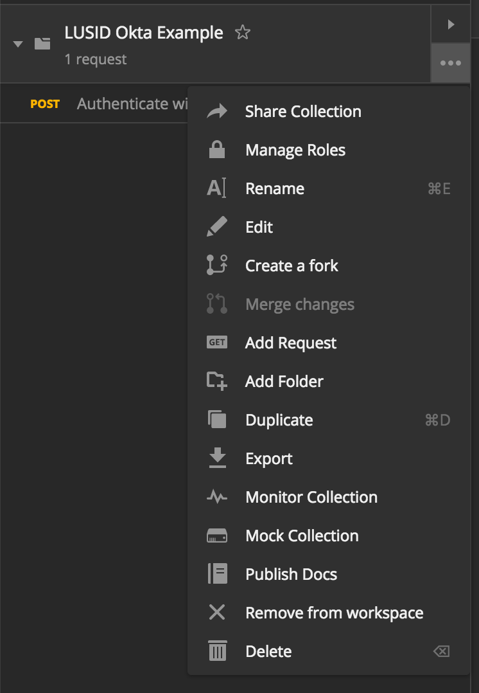
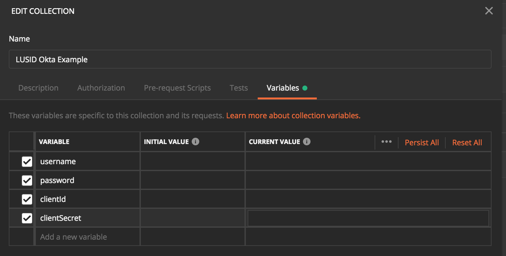
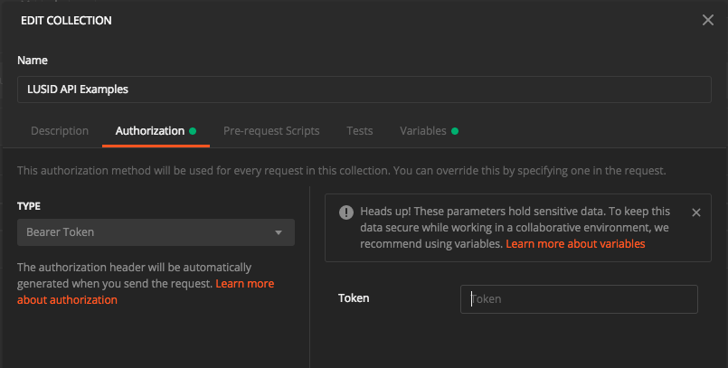

# Pre-requisites

The following are required to run the examples contained within this repository:
* [Postman](https://www.getpostman.com) (minimum 7.x)
* LUSID SDK credentials

# Running the examples

## Authentication

API calls to LUSID require obtaining an access token from Okta. To acquire the access token open the `LUSID Okta Example.postman_collection.json` in Postman and add in your supplied Okta credentials as variables:

Edit the collection:

Enter the variables. **NOTE: your password must be URL encoded when entered** and you must enter values fpr both `Initial Value` and `Current Value` columns.

Run the request and copy the value of the returned `access_token`.

## API Calls

In order to run the API calls you will need to add you `access_token` and set the required variables for the Postman collection.

Edit the collection details and on the `Authorization` tab set the type to be `Bearer Token` and paste in the `access_token` you previously copied. Update the required variables on the `Variables` tab.

Setting the access token:

